# git 基本原理

## git init

### 建立代码仓库

`git init` 初始化仓库

`watch -n 1 -d find .` 观察仓库目录状态变化 

**Note**	 `-n 1`代表每间隔1s, `-d`代表difference

```
ls -la 
注释：
	The ls -la command is a combination of ls -l (use a long listing format) and ls -a (do not ignore entries starting with.
	The ls -a means that hidden files are listed as well.显示所有文件及目录
	The ls -l part means a long list.  显示文件的详细属性信息


例如下面：
total 20  // 20 代表 the number of disc blocks
4 drwxr-xr-x 3 alex alex 4096 Dec 31 16:15 . 	//第一个4代表文件占用block 数，第二个2代表这个目录有几个文件
4 drwxr-xr-x 4 alex alex 4096 Dec 31 15:56 ..
4 drwxr-xr-x 6 alex alex 4096 Dec 31 16:18 .git
4 -rw-r--r-- 1 alex alex    6 Dec 31 16:10 hello.txt
4 -rw-r--r-- 1 alex alex    6 Dec 31 16:15 hello_1.txt

可以通过 getconf PAGESIZE 命令查看块大小

一个块（block）只可以容纳一个文件，也就是他有内存对齐，不能说没用完还继续拿来存储其他文件
total 值的大小就是所有文件和目录占用的块大小
可以用 ls -s 指令看每个文件占用的block数量

-------------------------------
drwxrwxr-x 13 anupam anupam 4096 Aug 28 21:45 .

 •权限使用10个字符进行表示
        第0位表示文件类型
        d：表示“etc”是目录而不是文件
        l：表示当前内容为链接
        -：表示当前内容为文件

• 第 1-3 位表示文件拥有者权限
        rwx ：拥有者具有读、写、执行的权限
•第4-6 位表示同组用户具有的权限
        r-x：同组用户具有读、执行的权限没有写权限
 •第7-9 位表示其他组用户具有的权限
        r-x：其他组用户具有读、执行的权限没有写权限

```

### 关于local配置和全局配置

(为了区分commit时候的用户)

```
local 配置 :
git config user.name "test"
git config user.email "test@test.com"

查看local 和 global 配置
git config -l
git config --global -l
```

------------


## git add

- 初始化之后

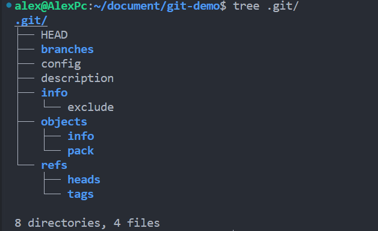

- 新建一个hello.txt

- `git status`

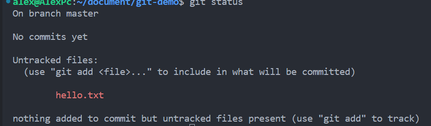

- run `git add hello.txt` :

**we can see a new object:**

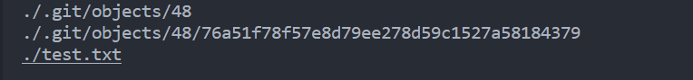

- run `tree .git`

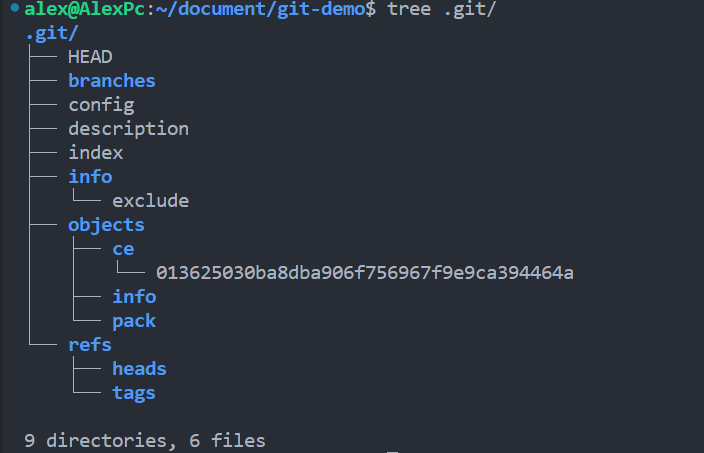

**可以发现多了1个目录（objects/ce）**

**多了2个文件：**

```
index
objects/ce/0136....        //0136...这串数字是 文件内容和文件类型  经哈希算法装换后的结果
```

**Note**	objects 有三种类型

- run `git cat-file -t ce0136`（查看对象类型）:

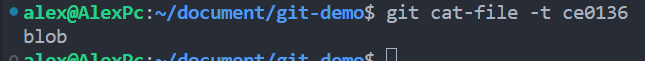

**Note**	`blob`就是我们上面生成的objects 的类型

- run `git cat-file -p ce0136`（查看对象内容）:

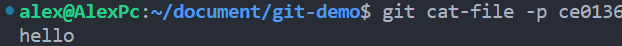

**Note**	上面两条命令也证明了 那串数字（哈希值）既存储了对象类型，也存储了对象内容。但是他没有存储文件名，下面的操作可以证明这点

**Note:**`git-cat-file` - Provide contents or details of repository objects

-t

Instead of the content, show the object **type** identified by `<object>`.

-s

Instead of the content, show the object **size** identified by `<object>`. If used with `--use-mailmap` option, will show the size of updated object after replacing idents using the mailmap mechanism.

-e

Exit with **zero status** if `<object>` exists and is a valid object. If `<object>` is of an invalid format, exit with non-zero status and emit an error on stderr.

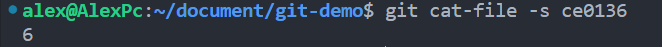

-p

Pretty-print the **contents** of `<object>` based on its type.

- run `echo "hello">hello_1.txt`

重新生成一个除了文件名，与 hello.txt 完全一样的文件

- run `git add hello_1.txt` 

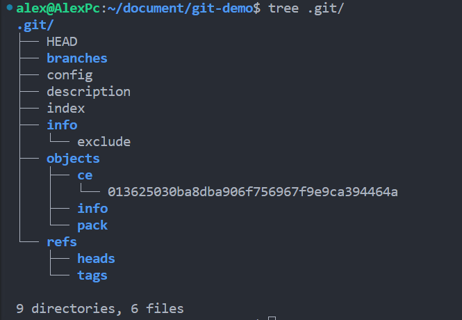

**Note** 	可以发现 objects 没有变化，这说明 blob 只存储内容，不存储文件名， 文件名是存储在其他地方的，后面课程会讲

**Q: 所有git 是怎么知道两个文件内容是完全相同的**

**A: 对比工作区与索引区 blob 对象内容**（见第4节）

**Note** 	关于这串哈希值是怎么生成的：通过`sha1`或者其他算法计算，了解即可

-------------

## blob 对象和 sha1 哈希

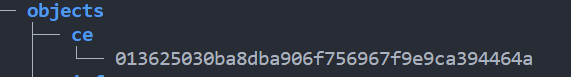

上图是我们的文件 blob 对象的哈希值，注意，git存储的文件内容是  **原始文件内容**  先进行   **压缩**，然后对  **压缩的结果**  存储在磁盘文件上 

哈希值的前两位是子目录名，后38位是子目录下文件名

--------------

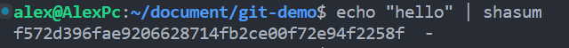

**Note** 	利用 shasum 工具可以发现，文件内容的哈希值和 blob 对象的不同，这也说明blob对象存储的不只是文件内容

-------------

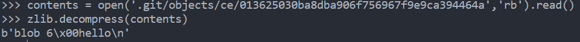

**Note**	利用python脚本可以解析出哈希值的内容，发现哈希值中包含的信息有对象类型，大小，文件内容（见 6.2）

-----------------------

## 工作区和索引区

**Working directory => Staging Area (index) => Git Repository**

**Note**	文件名 存储在 `index`

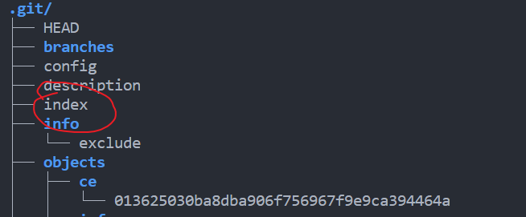

- run `git ls-files` `git ls-files -s`

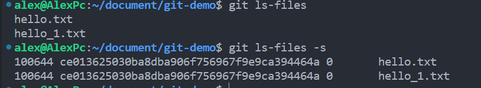

**Note**	100644 是文件类型


- 工作区新建一个文件，未 `add`时：

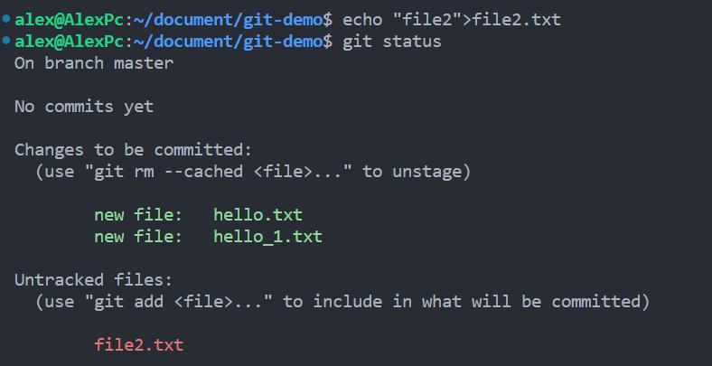

工作区新建的文件未`add`到索引区的时候，状态与索引区文件的状态是不同步的

- 当我们修改索引区的文件时

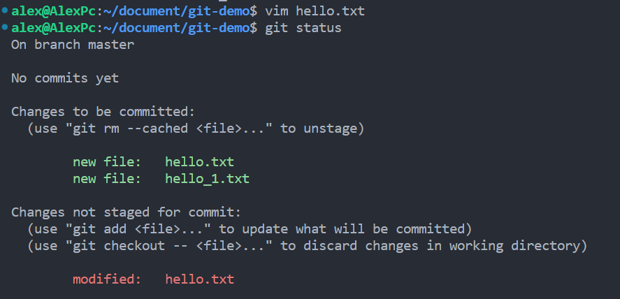

**Note**	此时工作区与索引区的 blob 对象不同，此时的对象如下图

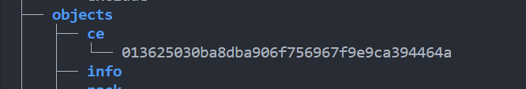


- 当我们将修改后的文件 `add`之后

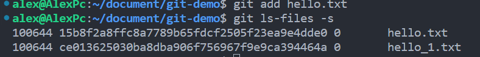

可以发现 blob 内容发生改变

- 然后我们再观察对象

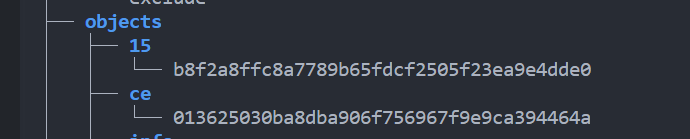

**Note**	发现现在有两个对象，（这里我由于之前还有一个hell0_1文件，有点影响）实际上如果只有一个对象，他修改后这里也是两个对象（一个修改前的，一个修改后的，他并不会把之前的对象给删除）

下面以 修改 file2.txt 为例说明

- 未修改之前


- 修改之后

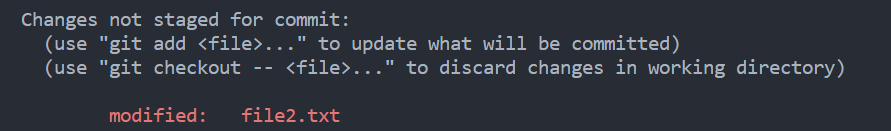

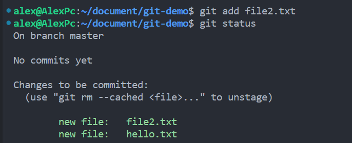

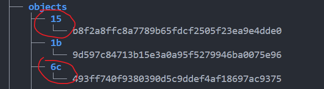

上图中是修改前、后的 file2 的 blob 对象

## git commit

- run `git commit -m "1st commit"`

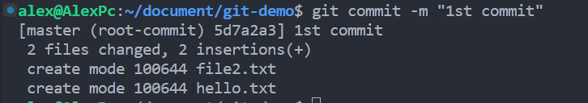

```
master : which branch
root-commit : first commit
5d7a2a3: commit 的 sha1 哈希值
1st commit: commit message
```

- 对比 `commit` 前后的文件：

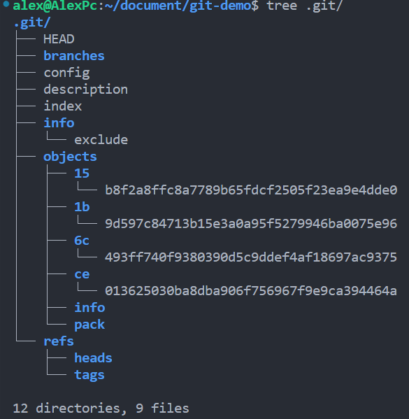

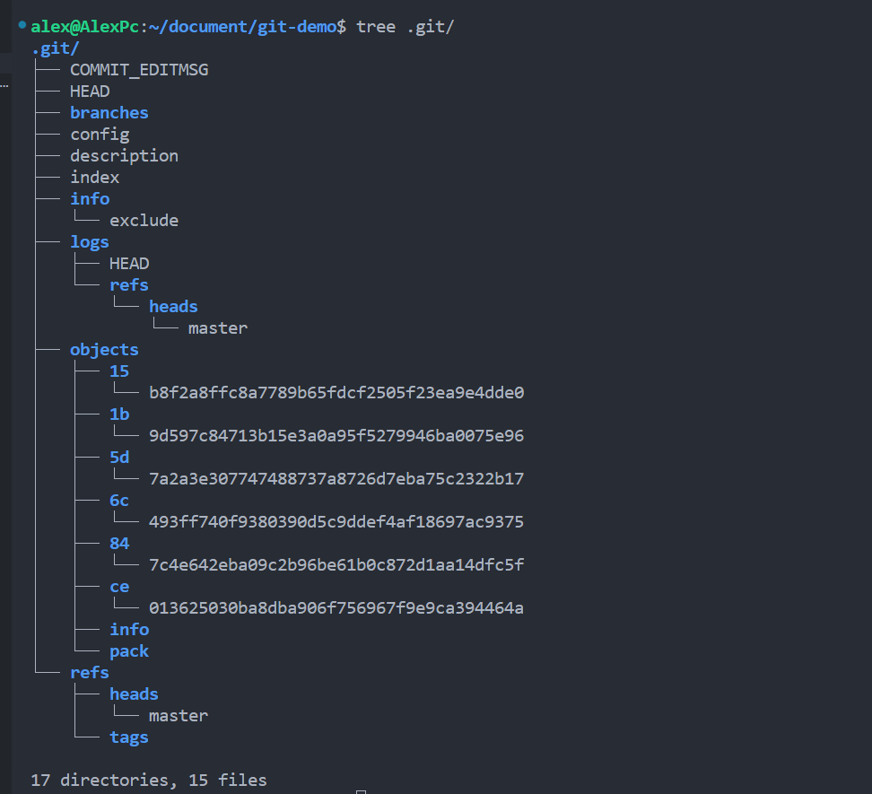


- 查看 `commit` 对象类型和内容

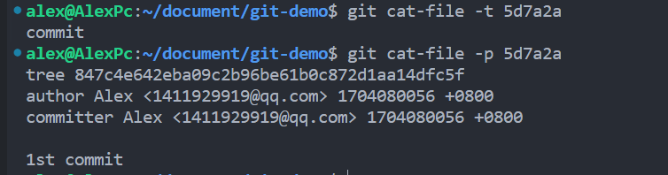

```
tree 847c4e642eba09c2b96be61b0c872d1aa14dfc5f	// tree : 第三种object
author Alex <1411929919@qq.com> 1704080056 +0800   //时间戳和时区
committer Alex <1411929919@qq.com> 1704080056 +0800
```

- 查看 `tree` object 

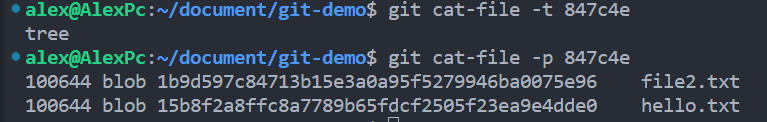

**Note**	文件类型为tree , 文件内容包括两个文件的 **文件名** 和 **blob** 对象，类似一种目录

- 下面是commit后的对象

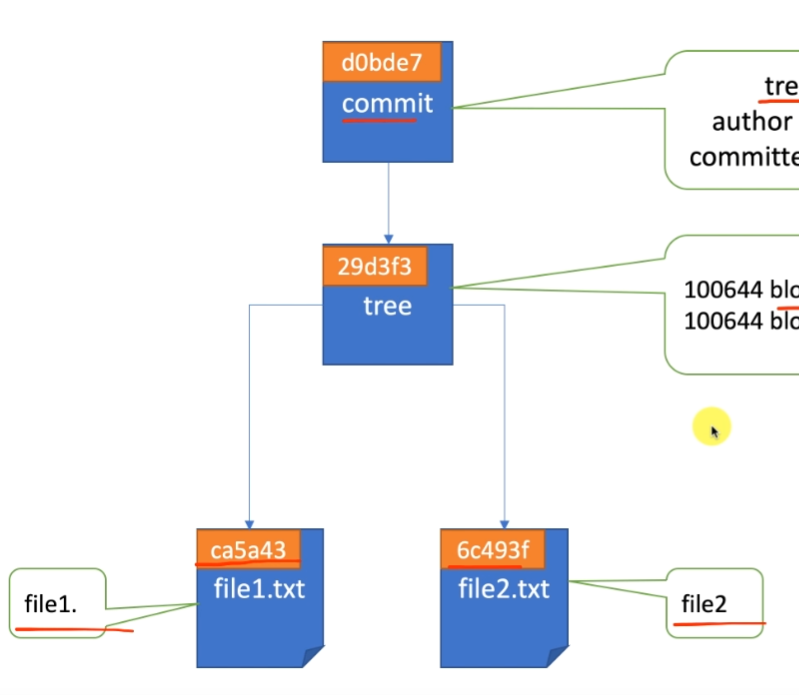


## Git internals 

- `.git` directory typically looks like:

```
config
description  //used only by the GitWeb program
hooks/		//contains your client- or server-side hook scripts
info/			//keeps a global exclude file for ignored patterns that you don’t want to track in a .gitignore file.
HEAD		//points to the branch you currently have checked out,
index			//stores your staging area information
objects/		//stores all the content for your database
refs/		//stores pointers into commit objects in that data (branches, tags, remotes and more)
```

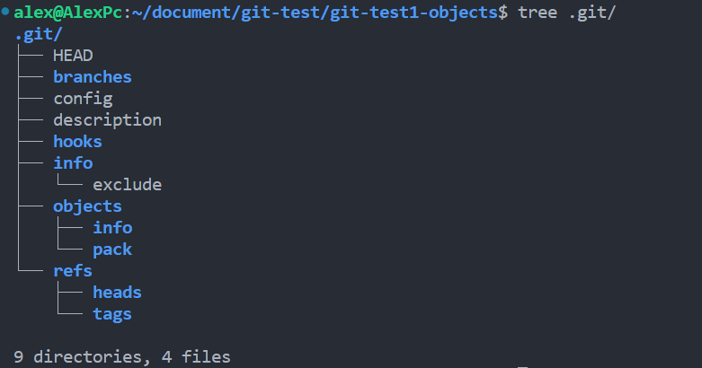

### Git Objects

#### Blob Objects

##### manually store object 

use `git hash-object` to create a new data object and manually store it in your new Git database

```
echo 'test content' | git hash-object -w --stdin
```

**Note**	

-w 		not simply return the key, but to write that object to the database

--stdin		tells `git hash-object` to get the content to be processed from stdin; 			otherwise, the command would expect a filename argument at the end of 			the command containing the content to be used.

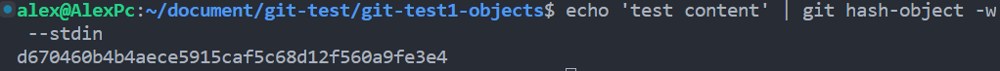

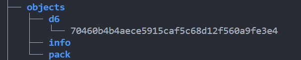

**Note**

1. output	 <u>d670460b4b4aece5915caf5c68d12f560a9fe3e4</u> 	is a 40-character checksum hash
2. remembering the SHA-1 **key** for each version of your file **isn’t practical**; plus, you **aren’t storing the** **filename** in your system — just the **content**.

##### use Git to retrieve

- you can delete your local copy of that `test.txt` file, then **use Git to retrieve**

```bash
## 先生成一个文件的两个版本
$ echo 'version 1' > test.txt
$ git hash-object -w test.txt

$ echo 'version 2' > test.txt
$ git hash-object -w test.txt
```

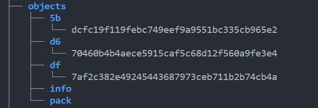

**Note**	 `5b` `df` 分别是两个版本的对象

- `rm test.txt`
- `git cat-file -p 5bdcfc>test.txt`
- 可以发现文件恢复到了 version1
- `git cat-file -t 5bdcfc`          输出：    blob


#### Tree Objects

**storing the filename and also allows you to store a group of files together**

```
$ git cat-file -p master^{tree}
100644 blob a906cb2a4a904a152e80877d4088654daad0c859      README
100644 blob 8f94139338f9404f26296befa88755fc2598c289      Rakefile
040000 tree 99f1a6d12cb4b6f19c8655fca46c3ecf317074e0      lib
```

```
$ git cat-file -p 99f1a6d12cb4b6f19c8655fca46c3ecf317074e0
100644 blob 47c6340d6459e05787f644c2447d2595f5d3a54b      simplegit.rb
```

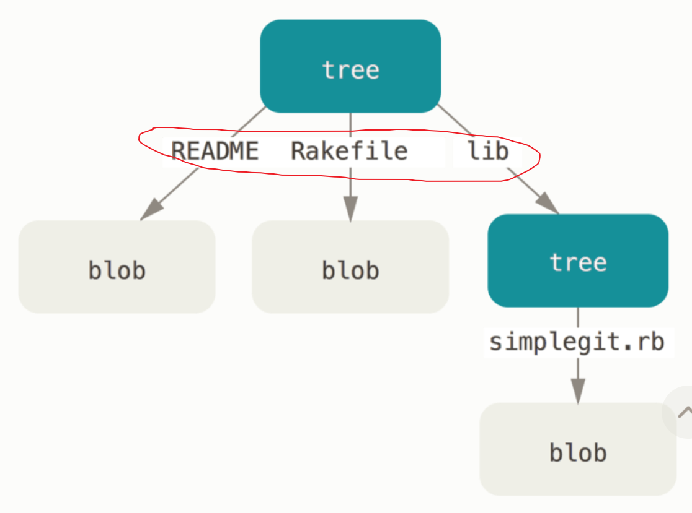

**Note**	红色圈中的是文件名，应该是存储在`index` (个人猜测)

  	Git normally creates a tree by taking the state of your **staging area or index** and writing a series of tree objects from it. So, to create a tree object, you **first have to set up an index** by staging some files. 


#### Commit objects

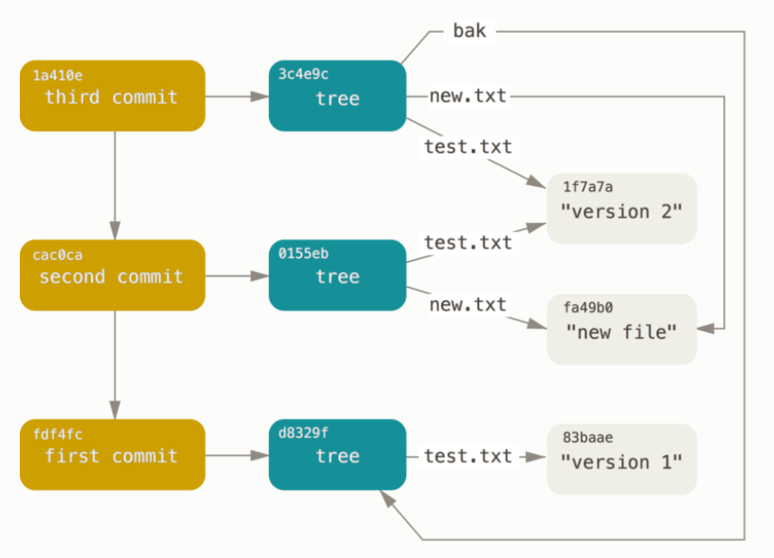

### Object Storage

```
header = "blob #{content.bytesize}\0"
store = header + content

eg: "blob 16\u0000what is up, doc?"

sha1 = Digest::SHA1.hexdigest(store)

 zlib_content = Zlib::Deflate.deflate(store)	// 压缩
 File.open(path, 'w') { |f| f.write zlib_content }  //写入路径
```

- ​	Git concatenates the header and the original content and then calculates the SHA-1 checksum of that new content. 

- ​	Git compresses the new content.

## 文件的状态


## 分支


### head

```bash
liuyuan@AlexMac:git-demo1 % cat .git/HEAD  
ref: refs/heads/master
## 查看head,指向master
liuyuan@AlexMac:git-demo1 % cat .git/refs/heads/master 
fc15a715659b9256429147b62c33e4e02c5c2e2d
## master 内容是一次commit
liuyuan@AlexMac:git-demo1 % git cat-file -t fc15
commit
## master 最新的一次提交是 fc15这次的commit
```

```bash
## 通过 git log 查看commit记录，发现head 指向 master 最新的一次 commit
liuyuan@AlexMac:git-demo1 % git log
commit fc15a715659b9256429147b62c33e4e02c5c2e2d (HEAD -> master)
Author: Alex <1411929919@qq.com>
Date:   Wed Jan 3 20:33:06 2024 +0800

    2nd commit: commit file2

commit f7a6f5e411d891ea41506875019e29d4d310ab35
Author: Alex <1411929919@qq.com>
Date:   Wed Jan 3 20:31:52 2024 +0800

    1st commit: commit file1
```

###  创建分支和切换分支

- 常用命令
    - `git branch`	列举出当前拥有的分支
    - `git branch <branch_name>`    创建一个分支
    - `git branch -D <branch_name>`     删除分支（不能删除当前所在的分支和不存在的分支）
    - `git checkout <branch_name>`        修改分支
- 创建一个新分支 `dev`

```bash
liuyuan@AlexMac:git-demo1 % git branch
* master
liuyuan@AlexMac:git-demo1 % git branch dev
liuyuan@AlexMac:git-demo1 % git branch    
  dev
* master  ## '*'代表当前指向的分支
```


- 查看 git log

```bash
liuyuan@AlexMac:git-demo1 % git log
commit fc15a715659b9256429147b62c33e4e02c5c2e2d (HEAD -> master, dev)
## 新创建的分支默认指向当前 master 的head
Author: Alex <1411929919@qq.com>
Date:   Wed Jan 3 20:33:06 2024 +0800

    2nd commit: commit file2

commit f7a6f5e411d891ea41506875019e29d4d310ab35
Author: Alex <1411929919@qq.com>
Date:   Wed Jan 3 20:31:52 2024 +0800

    1st commit: commit file1
```

- 查看 `dev` `master` 的 commit 

```bash
liuyuan@AlexMac:git-demo1 % cat .git/refs/heads/dev 
fc15a715659b9256429147b62c33e4e02c5c2e2d
liuyuan@AlexMac:git-demo1 % cat .git/refs/heads/master 
fc15a715659b9256429147b62c33e4e02c5c2e2d
## 两个分支指向的 commit 相同
```

- 切换到 `dev`  分支

```bash
liuyuan@AlexMac:git-demo1 % cat .git/HEAD 
ref: refs/heads/master
liuyuan@AlexMac:git-demo1 % git checkout dev
Switched to branch 'dev'
liuyuan@AlexMac:git-demo1 % cat .git/HEAD   
ref: refs/heads/dev
## 发现HEAD 从 master 指向了 dev
```

- 在` dev` 上进行一次 commit

```bash
liuyuan@AlexMac:git-demo1 % echo "dev">file3.txt
liuyuan@AlexMac:git-demo1 % git add .
liuyuan@AlexMac:git-demo1 % git commit -m "1st commit from dev: commit file3"
```

​				可以发现，dev 和 master 现在指向不同的 commit

```bash
liuyuan@AlexMac:git-demo1 % git log
commit 9d96cbf1b83374f863bcdd6bd3f999b341b8e0c5 (HEAD -> dev)
Author: Alex <1411929919@qq.com>
Date:   Wed Jan 3 20:58:57 2024 +0800

    1st commit from dev: commit file3

commit fc15a715659b9256429147b62c33e4e02c5c2e2d (master)
Author: Alex <1411929919@qq.com>
Date:   Wed Jan 3 20:33:06 2024 +0800

    2nd commit: commit file2

commit f7a6f5e411d891ea41506875019e29d4d310ab35
Author: Alex <1411929919@qq.com>
Date:   Wed Jan 3 20:31:52 2024 +0800

    1st commit: commit file1
```

### 删除分支

```bash
    -d, --delete          delete fully merged branch
    -D                    delete branch (even if not merged)
```

- `git branch -d` 不能删除当前工作分支

```bash
liuyuan@AlexMac:git-demo1 % git branch -d dev
error: Cannot delete branch 'dev' checked out at '/Users/Alex/Documents/git-course/git-demo1'

## 即使使用 git branch -D 删除当前工作分支，分支下的内容也不会删除
```

- ​	`git branch -D` 删除`dev` 分支

```
liuyuan@AlexMac:git-demo1 % git branch -D dev
Deleted branch dev (was 9d96cbf).
```

### 恢复误删分支

`git checkout ` 除了切换到分支上，也可以直接切换到某个`commit`对象上

当误删分支时，分支上的内容并未删除

- `git reflog`先找到误删除分支的commit对象

```bash
liuyuan@AlexMac:git-demo1 % git reflog
fc15a71 (HEAD -> master) HEAD@{0}: checkout: moving from dev to master
9d96cbf HEAD@{1}: commit: 1st commit from dev: commit file3
## 通过commit备注发现这是误删的dev分支,9d96cbf是commit的sha1
fc15a71 (HEAD -> master) HEAD@{2}: checkout: moving from master to dev
fc15a71 (HEAD -> master) HEAD@{3}: commit: 2nd commit: commit file2
f7a6f5e HEAD@{4}: commit (initial): 1st commit: commit file1
```

-  切换到该 switch 对象

```bash
liuyuan@AlexMac:git-demo1 % git checkout 9d96cbf
Note: switching to '9d96cbf'.

You are in 'detached HEAD' state. You can look around, make experimental
changes and commit them, and you can discard any commits you make in this
state without impacting any branches by switching back to a branch.

If you want to create a new branch to retain commits you create, you may
do so (now or later) by using -c with the switch command. Example:

  git switch -c <new-branch-name>

Or undo this operation with:

  git switch -

Turn off this advice by setting config variable advice.detachedHead to false

HEAD is now at 9d96cbf 1st commit from dev: commit file3
```

- `git switch `

```bash
liuyuan@AlexMac:git-demo1 % git switch -c dev
Switched to a new branch 'dev'
liuyuan@AlexMac:git-demo1 % git branch 
* dev
  master
############
liuyuan@AlexMac:git-demo1 % git log
commit 9d96cbf1b83374f863bcdd6bd3f999b341b8e0c5 (HEAD -> dev)
Author: Alex <1411929919@qq.com>
Date:   Wed Jan 3 20:58:57 2024 +0800

    1st commit from dev: commit file3

commit fc15a715659b9256429147b62c33e4e02c5c2e2d (master)
Author: Alex <1411929919@qq.com>
Date:   Wed Jan 3 20:33:06 2024 +0800

    2nd commit: commit file2

commit f7a6f5e411d891ea41506875019e29d4d310ab35
Author: Alex <1411929919@qq.com>
Date:   Wed Jan 3 20:31:52 2024 +0800

    1st commit: commit file1
###########
liuyuan@AlexMac:git-demo1 % cat .git/refs/heads/dev 
9d96cbf1b83374f863bcdd6bd3f999b341b8e0c5
 ## 可以发现dev分支指向了对应commit,恢复成功
```

## 远程仓库

- 创建仓库
- 连接仓库 `git remote add origin ssh/https`

```bash
liuyuan@AlexMac:git-demo1 % git remote add origin git@github.com:Erizo0818/git-demo.git
## origin 是远程仓库名
liuyuan@AlexMac:git-demo1 % cat .git/config 
[core]
        repositoryformatversion = 0
        filemode = true
        bare = false
        logallrefupdates = true
        ignorecase = true
        precomposeunicode = true
[remote "origin"]
        url = git@github.com:Erizo0818/git-demo.git
        fetch = +refs/heads/*:refs/remotes/origin/*
        
## 查看config,发现配置好了url和fetch
```

- `git push`

```bash
liuyuan@AlexMac:git-demo1 % git push -u origin master
Enumerating objects: 6, done.
Counting objects: 100% (6/6), done.
Delta compression using up to 8 threads
Compressing objects: 100% (3/3), done.
Writing objects: 100% (6/6), 455 bytes | 455.00 KiB/s, done.
Total 6 (delta 0), reused 0 (delta 0), pack-reused 0
To github.com:Erizo0818/git-demo.git
 * [new branch]      master -> master
branch 'master' set up to track 'origin/master'.
```

- `tree .git`观察`push`后的文件变化

```bash
21 directories, 35 files	 ## push 前
25 directories, 37 files   ## push 后
```

 

分别添加了 `remotes`  `origin`  目录两个，也就是总共增加4个目录

增加了两个`master` 文件

- 查看本地和远程的 `master` 分支

```bash
liuyuan@AlexMac:git-demo1 % cat .git/refs/remotes/origin/master 
fc15a715659b9256429147b62c33e4e02c5c2e2d
liuyuan@AlexMac:git-demo1 % cat .git/refs/heads/master 
fc15a715659b9256429147b62c33e4e02c5c2e2d
## 发现两个分支指向同一个commit
```


查看 `git log` 发现本地master 和 远程 master 指向同一个分支

